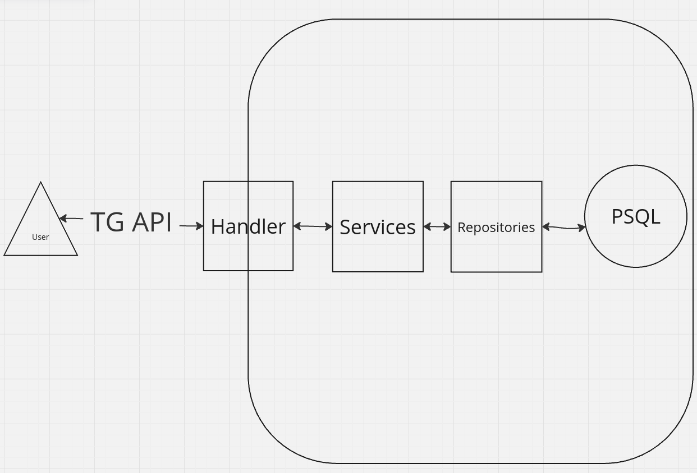
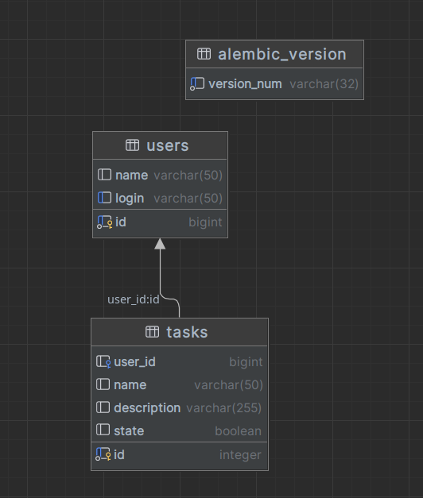

# test_maxbit

## Общее описание задачи и ее контекста
Создать бота для телеграма, в котором пользователь может:
    - Зарегистрироваться
    - Создать задачу
    - Выполнить задачу
    - Удалить задачу    
    - Посмотреть список задач

## Обзор выбранных технологий и инструментов
Таковы были требования к тестоваму заданию

## Архитектурное описание вашего решения, включая диаграмму компонентов и взаимодействий.
Решение состоит из 3 основных блоков.
    - Хэндлер
    - Сервис - обработка запросов хэндлера
    - Репозиторий - работа с базой данных на основании логики сервиса

Диаграмма взаимодействия компонентов:


## Описание основных классов и функций, их назначения и взаимодействия.
Основной класс BotHandler,
который обрабатывает запросы пользователя и передает их в соответствующий сервис при помощи функции filter_state.
Сервисы:
    - UserHandlerMixin
    - TaskHandlerMixin

## Подробное описание реализованной функциональности, включая примеры использования бота.
Пользователь может:
    - Зарегистрироваться
    - Создать задачу
    - Выполнить задачу
    - Удалить задачу    
    - Посмотреть список задач

При первом входе пользователю предлагается ввести Имя, после чего предлагается ввести уникальный логин.
После успешной регистрацци у пользователя появляется 2 кнопки:
    - Создать задачу
        После нажанию на которую ему необходимо ввести название задачи, затем описание.
        После успешного заполнения полей пользователя уведомляет что задача создана.
    - Посмотреть список задач
        После нажатия на кнопку пользователю выводится список задач, которые он создал либо уведомляется что задач нет.
        У каждой задачи есть 2 кнопки:
            - Выполнить
                После нажатия на кнопку задача помечается как выполненная
            - Удалить
                После нажатия на кнопку задача удаляется из списка задач пользователя

## Описание использованных SQL-запросов и структуры базы данных
База данных состоит из 3 таблиц 1 из которых является технической:
2 другие таблицы это таблица пользователей и таблица задач.


SQL-запросы:
    
    Получение имени пользователя по его id    
    'SELECT users.name FROM users WHERE users.id = :id_1'
    
    Проверка наличия пользователя в базе по логину
    'SELECT users.login FROM users WHERE users.login = :login_1'
    
    Добавление нового пользователя
    'INSERT INTO users (id, name, login) VALUES (:id, :name, :login) RETURNING users.id'
    
    Добавление новой задачи
    'INSERT INTO tasks (user_id, name, description, state) VALUES (:user_id, :name, :description, :state) RETURNING tasks.id'
    
    Получение списка задач пользователя
    'SELECT tasks.id, tasks.name, tasks.description, tasks.state 
    FROM tasks 
    WHERE tasks.user_id = :user_id_1 ORDER BY tasks.id'
    
    Обновление статуса задачи
    'UPDATE tasks SET state=:state WHERE tasks.id = :id_1'
    
    Удаление задачи
    'DELETE FROM tasks WHERE tasks.id = :id_1'

##  Инструкции по развертыванию и запуску вашего приложения
Установить docker и docker-compose
Создать файл .env на основе .env.example и указать необходимые значения всех переменных
Запустить ```docker-compose up --build``` в терминале

BOT_TOKEN можно получить у @BotFather в телеграме
API_ID и API_HASH можно получить на https://my.telegram.org/auth